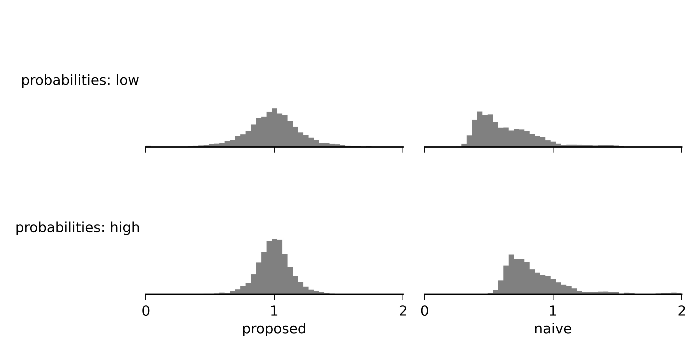

Bluetooth Vehicle Tracking:  Correcting Short Trip Bias
=======================================================

.. author:: default
.. categories:: none
.. tags:: none

A new thing in transportation analysis is the use of arrays of Bluetooth detectors
to track cars. The detectors work by recording the MAC IDs of wireless devices inside cars that 
pass nearby. By linking together multiple detections of the same MAC ID across different detectors,
you can make a pretty good guess at the starting point, ending point, and route taken for a trip. 

There is one problem, however. Detectors can "miss" cars: even though a car has a wireless device
inside, and it passes near a detector, the detector may fail to detect it. This has the effect of 
making some trips appear shorter than they really are. Take for example a car that passes near detectors
1, 2, and 3. If detector 1 misses the car, the trip will appear to have passed by only 
detectors 2 and 3.

To fix this problem, I've proposed an estimation method that explicitly accounts for missed
detections. My tests show improvements over a naive method that ignores missed detections:

   
See my paper_ and IPython notebook_ for details on the estimation method.

.. _paper: http://ericstalbot.github.io/bluetooth/TalbotBluetooth.pdf
.. _notebook: http://ericstalbot.github.io/bluetooth/RouteFlowsRoadsideDetectors-v2.html
   