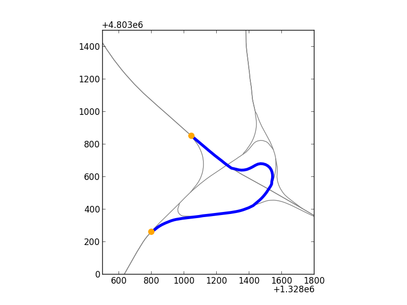

spatialdigraph
==============

.. author:: default
.. categories:: none
.. tags:: none

NetworkX is a great Python package for working with networks. It sits right next to NumPy, matplotlib, and Shapely in my everyday transportation analysis toolbox. However, I've often wished that Networkx graphs had spatial capabilities. So that's why I created spatialdigraph_. Here's how it works:

First, load a SpatialDiGraph of a highway interchange in New Hampshire::

    g = cPickle.load(open('mygraph.pickle'))
    
This graph is in WGS84, so let's transform to UTM for better drawing::

    g.transform(fiona.crs.from_epsg(32617))
    
And now we can draw the graph::

    fig, ax = plt.subplots(1,1)
    g.draw(ax, node_args = {'s':0}, edge_args = {'c':'0.5'})
    
The SpatialDiGraph is a networkx.DiGraph subclass, so we have access to lots of useful 
methods from NetworkX. For example, we can get a shortest path on the network::

    origin, destination = '194912632', '195049052'
    path = networkx.shortest_path(g, origin, destination)
    
Then with the added functionality that the SpatialDiGraph provides we can draw the path::

    x,y = g.xy(*path)
    ax.plot(x,y, c = 'b', lw = 4)
    
And just to make it pretty, let's also highlight the origin and destination nodes::

    scatter_args = dict(zorder = 10, c = 'orange', s = 80, edgecolor = 'none')

    x,y = g.xy(origin)
    ax.scatter(x,y, **scatter_args)

    x,y = g.xy(destination)
    ax.scatter(x,y, **scatter_args)
    
Here's the final result:

spatialdigraph is still a work in progress, but feel free to `check it out`_ on GitHub. 
   
   
.. _spatialdigraph: https://github.com/ericstalbot/spatialdigraph

.. _check it out: spatialdigraph_

